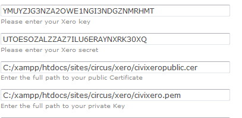

# nz.co.fuzion.civixero

Synchronisation [CiviCRM](https://civicrm.org) and [Xero](https://xero.com) for financial transactions and contacts.

This extension requires the [AccountSync extension](https://github.com/eileenmcnaughton/nz.co.fuzion.accountsync).

It sets up scheduled jobs that synchronize Xero contacts and invoices with CiviCRM contacts and invoices.

Interaction with this module is primarily by API and it creates scheduled jobs to run those API.

## Customisation &amp; Additional Extensions

To modify the behaviour of the CiviXero extension various hooks are available. The additional CiviCRM extensions are available:

[Xero Tweaks](https://github.com/agileware/au.com.agileware.xerotweaks)
- Removes the Contact ID from their Xero name.
- Includes additional address lines in the contact address.
- Removes the Contact's name from the Invoice Reference and Line items.

[Xero Untax](https://github.com/agileware/au.com.agileware.xerountax)
- Remove tax details from line items sent via CiviXero, so Xero can figure it out avoiding rounding issues.

[Xero Items](https://github.com/agileware/au.com.agileware.xeroitems)
- Replaces Xero account codes with [Xero item codes](https://help.xero.com/nz/Inventory) (also referred to as Xero inventory items)

## Setup extensions

In the server in the sites, extensions folder in a terminal window you can run the command

`git clone https://github.com/eileenmcnaughton/nz.co.fuzion.civixero.git`

and the same for AccountSync

`git clone https://github.com/eileenmcnaughton/nz.co.fuzion.accountsync.git`

then you will have the extensions added to the site.

To use these extensions on the site, on the CiviCRM menu on the site go to administer - customise data and screens - manage extensions. There you should install CiviXero and AccountSync.

## Setup XERO OAuth 2.0

You will need to have set up an company/organisation and an OAuth 2.0 App with XERO.

### Company/Organization
For testing purposes, you can use the [Xero Demo Company](https://central.xero.com/s/article/Use-the-demo-company)

### Create Xero App
Before creating the app, it will help to be logged into CiviCRM as well as Xero.

Go to https://developer.xero.com/

On the menu, click on __MyApps__, then click __New app__.

Use the following details:
- Company or application URL: https://YOUR-SITE-URL
- OAuth 2.0 redirect URI: For Drupal installations this will be
  https://YOUR-SITE-URL/civicrm/xero/authorize.
  For WordPress installations, copy the url from the link CiviCRM : Administer -> Xero -> Xero Authorize.  

After the app is created, click the button to generate a Client Secret.
Copy the Client ID and the Client Secret, you will need them later.

## Setup in CiviCRM

### CiviXero Settings
You then need to add the __Client ID__ and __Client Secret__ in the Xero Settings page in CiviCRM (Administer>Xero>Xero Settings)

On this page you should also define which edit and create actions should trigger contacts / invoices to be created / edited in Xero

(Due to current CiviCRM bug, disable and re-enable CiviCRM logging if you are using db logging)

### Authorizing with Xero
Next, authorize the app to access your Xero Company data. In CiviCRM, go to (Administer>Xero>Xero Authorize).
Click the button to Authorize. You will be prompted for your Xero credentials and then further prompted to grant the app various permissions.
You should then be returned to the Authorize page. The page will show a status to indicate it has successfully connected to Xero.

### Set up Synchronization
Once authorized you interact with CiviXero via the scheduled jobs page and the api. Matched contacts should show links on their contact summary screen and matched contributions should show links on the invoices

CiviCRM tracks synchronisation in the civicrm_account_contact table - to populate this from xero run the api command civixero contactpull with a start_date - e.g '1 year ago'

e.g
drush cvapi civixero.contactpull start_date=0

  You can create a link from Xero back to your site by going to settings/ Custom links and adding a link pointing to

  https://YOURSITE/civicrm/contact/view?reset=1&cid={!CONTACTCODE}
