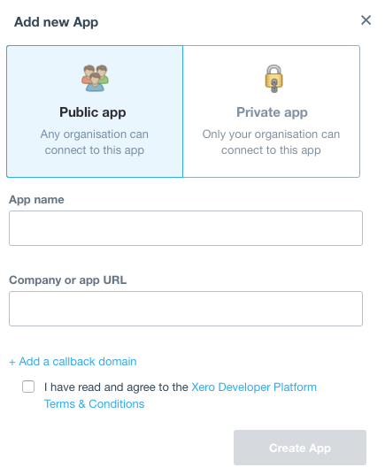
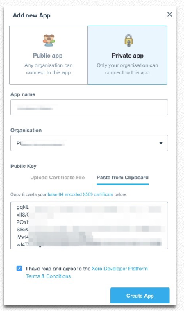
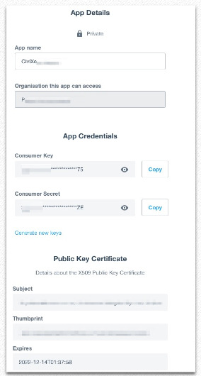

# nz.co.fuzion.civixero

Synchronisation [CiviCRM](https://civicrm.org) and [Xero](https://xero.com) for financial transactions and contacts.

This extension requires the [AccountSync extension](https://github.com/eileenmcnaughton/nz.co.fuzion.accountsync).

It sets up scheduled jobs that synchronize Xero contacts and invoices with CiviCRM contacts and invoices.

Interaction with this module is primarily by API and it creates scheduled jobs to run those API.

## Customisation &amp; Additional Extensions

To modify the behaviour of the CiviXero extension various hooks are available. The additional CiviCRM extensions are available:

[Xero Tweaks](https://github.com/agileware/au.com.agileware.xerotweaks)
- Removes the Contact ID from their Xero name.
- Includes additional address lines in the contact address.
- Removes the Contact's name from the Invoice Reference and Line items.

[Xero Untax](https://github.com/agileware/au.com.agileware.xerountax)
- Remove tax details from line items sent via CiviXero, so Xero can figure it out avoiding rounding issues.

[Xero Items](https://github.com/agileware/au.com.agileware.xeroitems)
- Replaces Xero account codes with [Xero item codes](https://help.xero.com/nz/Inventory) (also referred to as Xero inventory items)

## Setup extensions

In the server in the sites, extensions folder in a terminal window you can run the command

`git clone https://github.com/eileenmcnaughton/nz.co.fuzion.civixero.git`

and the same for AccountSync

`git clone https://github.com/eileenmcnaughton/nz.co.fuzion.accountsync.git`

then you will have the extensions added to the site.

To use these extensions on the site, on the CiviCRM menu on the site go to administer - customise data and screens - manage extensions. There you should install CiviXero and AccountSync.

## Setup XERO keys

Log into https://api.xero.com/Application?redirectCount=0

Choose My Applications, Add application and choose the Private App option

Follow the Xero instructions to set up a .cer and public key

https://developer.xero.com/documentation/auth-and-limits/private-applications

This involves running the following 3 commands in terminal if you are a mac user

1 - openssl genrsa -out privatekey.pem 1024

2 - openssl req -new -x509 -key privatekey.pem -out publickey.cer -days 1825

3 - openssl pkcs12 -export -out public_privatekey.pfx -inkey privatekey.pem -in publickey.cer

from https://developer.xero.com/documentation/api-guides/create-publicprivate-key

Ensure the above files are correctly permissioned so they are readable by the user that php is running as.

Either copy and paste or download the .cer (publickey) file and put into the Xero new app.

Save the new app and you should see the app details page in Xero.

## Setup in CiviCRM

You then need to enter the Xero keys (seen on the app details page) into the Xero Settings page in CiviCRM (Administer>Xero>Xero Settings)

Enter the relevant keys and paths
Consumer Key = Xero Key
Consumer Secret = Xero Secret

On this page you should also define which edit and create actions should trigger contacts / invoices to be created / edited in Xero

(Due to current CiviCRM bug, disable and re-enable CiviCRM logging if you are using db logging)

Once installed you interact with CiviXero via the scheduled jobs page and the api. Matched contacts should show links on their contact summary screen and matched contributions should show links on the invoices

CiviCRM tracks synchronisation in the civicrm_account_contact table - to populate this from xero run the api command civixero contactpull with a start_date - e.g '1 year ago'

e.g
drush cvapi civixero.contactpull start_date=0

  You can create a link from Xero back to your site by going to settings/ Custom links and adding a link pointing to

  https://YOURSITE/civicrm/contact/view?reset=1&cid={!CONTACTCODE}
